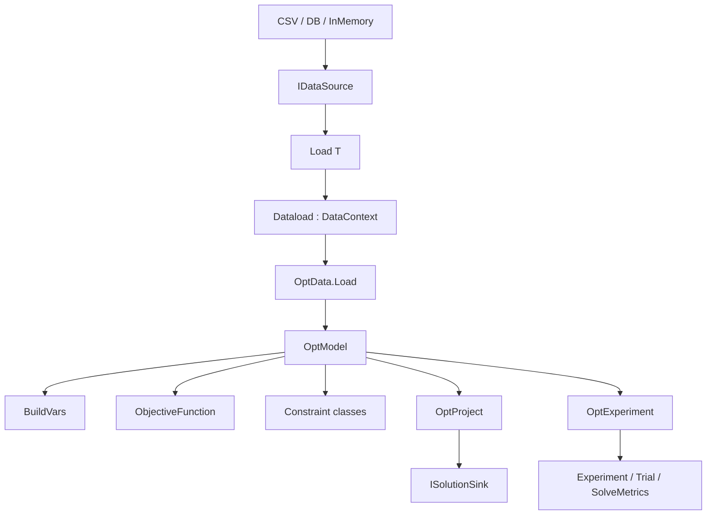

# CodeMap

## Dependency graph



`OptData.Load` 自動驗證 Set／Parameter duplicate key 與 Parameter numeric sanity，再 freeze framework-controlled registration。Parameter→Set relation 由開發者掌握；`FindParameterOrLog` 在缺值時留下 Warning。

## Project structure

```text
Projects/<Project>/
├── Model/<Project>_Model.md
├── Set/Set_*.cs
├── Parameter/Parameter_*.cs
├── Variable/Variable[B|C|I]_*.cs
├── Objective/ObjectiveFunction.cs
├── Constraint/Constraint_*.cs
├── Solution/<Project>Solution.cs
├── Data/Dataload.cs
├── Data/*.csv
├── Program.cs
└── <Project>.csproj
```

## Data API

| Symbol | Role |
| --- | --- |
| `[OptSet]` + primitive `OptDim` | 一到多維 Set row |
| `[OptParam]` + primitive `OptDim` | 零到多維 Parameter row + QTY |
| `IDataSource.Load<T>` | Set/Parameter 共用 typed load |
| `CsvCtrl.WriteRows<T>` | Set/Parameter 共用 canonical CSV output |
| `CsvDataSource` | `Data/{name}.csv` |
| `InMemoryDataSource` | `AddRows` 註冊資料 |
| `DbDataSource` | query-only source；名稱引數是 SQL |

## Model API

| Symbol | Role |
| --- | --- |
| `[OptVar]` + B/C/I prefix | generated variable row 與型別 |
| `BuildVars<T>` | 一般 variable build 入口 |
| `BuildBVs/CVs/IVs` | 明確型別與 bounds 進階入口 |
| `AddLHS` / `AddRHS` | 保留原數學式左右側 |
| `CreateXxx(this, dims...)` | canonical constraint naming |
| `OptModel` | Variables → Objective → Constraints 模型定義 |

## Runner/config API

| Symbol | Role |
| --- | --- |
| `ProjectConfig` | 專案身分、log、輸出 |
| `CplexConfig` / `GurobiConfig` | solver 行為 |
| `OptProject` | 單一模型 production execute + OnSolved |
| `OptExperiment` | model × config trials，不執行 production callback |

## Repository references

| Path | Role |
| --- | --- |
| `.claude/skills/AGENTS.md` | phase gates 與治理 |
| `.claude/skills/coding/optimfoundation-api-guide.md` | Phase 2 API 權威 |
| `.claude/skills/coding/model-to-code-checklist.md` | 驗收 |
| `tutorial(for developer)/` | 人類向教學與 prompt |
| `Template/` | consumer scaffold |
| `Projects/HospitalRostering_Generator/` | 可運作 generator 專案；部分資料建立方式是既有示例，不作 IO scaffold |
| `dlls/` | framework binary snapshot |

AI-Modeling 是 DLL consumer，framework references 使用 repo-local `HintPath`，generator 使用 Analyzer reference；不跨 repository 建 `ProjectReference`。
