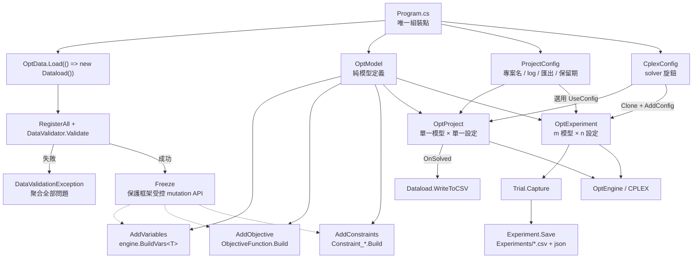

# CodeMap：模型定義與對稱 runner

預設路線使用 `[OptVar]` / `[OptParam]` source generator；`OptModel` 只保存模型定義，`OptProject` 與 `OptExperiment` 是兩個執行環境。手寫 class 與手寫 `XxxProblem.Execute()` composition root 均已廢止（2026-08-08），只在 `HospitalRostering_Manual` 留作歷史對照。

## Dependency Graph

框架固定模型套用順序為 variables → objective → constraints，與 fluent 註冊先後無關。`OptData.Load` 回傳前會凍結 `DataContext` 的框架受控註冊入口；因既有消費端仍有 public fields 與可變 `List`，直接指定欄位或呼叫 `List.Add` 不保證立即攔截。

## Config 邊界

| 型別 | 責任 | 預設 / 規則 |
|---|---|---|
| `ProjectConfig` | `ProjectName`、`RetentionDays`、`EnableSolverLog`、`ExportLP/MPS/Sol`、輸出身分 | 專案執行預設 log ON、匯出 OFF；不進 solver snapshot |
| `CplexConfig` | `epGap`、`timeLimit`、`workThreads`、cuts、emphasis 等 CPLEX 旋鈕 | `null` 交給 CPLEX 預設；可用 `Clone()` 疊加實驗設定 |
| `OptProject` | housekeeping、有效設定 log、build / solve、成功後 callback | `.UseConfig` 分別接兩層 config；只有它提供 `OnSolved` |
| `OptExperiment` | 序列執行笛卡兒積或明列 cell，儲存 trial | 預設 solver log OFF、匯出 OFF、不做 housekeeping；沒有 `OnSolved` |

## File Index

| 路徑 | 行數 | 角色 |
|---|---:|---|
| `README.md` | 213 | repo 入口、DLL HintPath 規則、paved-path 範例 |
| `ROADMAP.md` | 117 | 架構決策與落地狀態 |
| `../rules/Ph3_Tuning/cplex-tuning-strategy.md` | 306 | solver tuning 流程與 `OptExperiment` 掃描方式 |
| `../../tutorial(for developer)/ai-modeling-framework-tutorial.md` | 378 | Modeling → Coding → Tuning 教學 |
| `../../tutorial(for developer)/development-workflow.md` | 206 | 端到端工作流導覽 |
| `Template/Program.cs` | 目前專案檔為準 | generator paved path 的 executable composition root |
| `Projects/<Project>/Program.cs` | 各專案不同 | `OptModel` + `OptProject` + `OptExperiment` 組裝點 |
| `dlls/OptimFoundation.Core.dll` | binary | `ProjectConfig`、`DataContext`、experiment records |
| `dlls/OptimFoundation.Cplex.dll` | binary | `CplexConfig`、`OptModel`、兩種 runner、`OptEngine` |
| `dlls/OptimFoundation.Generators.dll` | binary | consumer-side source generator analyzer |

AI-Modeling 是 DLL 消費端：各 `.csproj` 的 OptimFoundation / ILOG / NLog 都以 `<Reference>` + repo `dlls/` 的 `HintPath` 引用；generator 以 `<Analyzer Include="...OptimFoundation.Generators.dll" />` 掛入。不要改成跨 repo `ProjectReference`。

## Symbol Index

| Symbol | 模組 | Export / 簽名 | 角色 |
|---|---|---|---|
| `OptModel` | OptimFoundation.Cplex | `new(name).AddVariables(Action<OptEngine>).AddObjective(...).AddConstraints(...)` | 可重用、純註冊的模型定義；不持有 engine |
| `OptProject` | OptimFoundation.Cplex | `new(model).UseConfig(Func<ProjectConfig>).UseConfig(Func<CplexConfig>).OnSolved(...).Execute()` | 單次專案 runner |
| `OptExperiment` | OptimFoundation.Cplex | `new(name, desc).UseConfig(...).AddModel(model).AddConfig(label, config).AddTrial(...).Run()` | m×n 實驗 runner；label 為 `模型名 | 設定名` |
| `ProjectConfig` | OptimFoundation.Core | PascalCase properties + `Clone()` | 專案身分與輸出策略；`EnableSolverLog` 預設 `true` |
| `CplexConfig` | OptimFoundation.Cplex | solver fields / adapters + `Clone()` | 純 solver 設定；snapshot 不含專案輸出開關 |
| `OptEngine` | OptimFoundation.Cplex | `Build*Vs`、Pool API、`Solve`、取解 API | CPLEX 求解窗口 |
| `OptData` | OptimFoundation.Core | `Load<T>(Func<T>) where T : DataContext` | 建構、註冊、驗證、凍結後回傳資料 |
| `DataContext` | OptimFoundation.Core | `Initialize()`、`Freeze()`、`GuardMutation(member)` | 資料防護基底；凍結僅保證框架受控 mutation API |
| `Experiment` / `Trial` | OptimFoundation.Core | `Experiment.Save()` / `Trial.Capture(...)` | 實驗結果與 solver snapshot；一般由 `OptExperiment` 使用 |

## Paved path

1. 只用 `OptData.Load` 建構一份 `data`。
2. 在 `Program.cs` 直接註冊三個模型階段，不新增中介組裝類別。
3. 專案輸出行為放 `ProjectConfig`，solver 參數放 `CplexConfig`。
4. 同一個 `OptModel` 交給 `OptProject` 求解，或交給 `OptExperiment` 比較 clone 後的 solver 設定。
5. AI-Modeling 一律保留 repo-local DLL `HintPath`；框架 source tree 內部範本的依賴策略不套用到此 repo。
