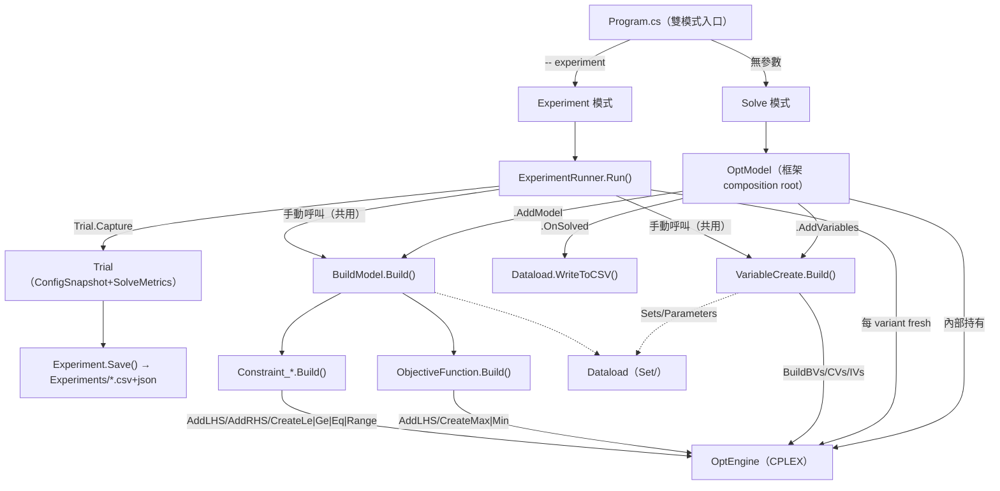

# CodeMap：CPLEX 建模專案（新版 Fluent OptModel + Tuning）

> **雙架構更新（2026-06-22）**：框架現支援兩種建構方式——預設 generator（`[OptVar]`/`[OptParam]`）+ Fluent `OptModel`，後路手寫 class + `XxxProblem.Execute()`。本圖描述的是**預設**的 OptModel pipeline；兩架構並排對照（含 Manual 版）見 [dual-architecture CodeMap](specs/2026-06-22-dual-architecture-CodeMap.md) 與 [spec](specs/2026-06-22-dual-architecture-tutorial.md)。

[TOC]

- [Dependency Graph](#dependency-graph)
- [File Index](#file-index)
- [Symbol Index](#symbol-index)

## Dependency Graph

要點：`VariableCreate` 與 `BuildModel` 是**兩模式共用**的 build-step；solve 模式由 `OptModel` 驅動、experiment 模式由 `ExperimentRunner` 驅動，建模邏輯不重複。

## File Index

| 路徑 | 角色 | 新版動作 |
|------|------|----------|
| `Program.cs` | 唯一入口，solve/experiment 分派 | 重寫為雙模式 |
| `ExperimentRunner.cs` | tuning 掃描器 | 新增（每專案標配） |
| `Set/<Proj>Dataload.cs` | Sets/Parameters/WriteToCSV | namespace→`Proj.Set` |
| `Variable/VariableCreate.cs` | 建立所有決策變數 | 共用，不變邏輯 |
| `Variable/VariableB_*/X_*/I_*.cs` | 變數型別宣告 | namespace 對齊 |
| `Constraint/BuildModel.cs` | 目標式+限制式組裝入口 | 共用 |
| `Constraint/Constraint_*.cs` | 各條限制式 | 可用 `CreateRange` |
| `Objective/ObjectiveFunction.cs` | 目標式 | 不變 |
| `Parameter/Parameter_*.cs` | `ParameterBase`（QTY） | namespace 對齊 |
| `Model/<Proj>_Model.md` | 數學模型 | 不變 |
| ~~`<Proj>Problem.cs`~~ | 舊手寫 Execute | **刪除** |

## Symbol Index

| Symbol | 模組 | Export / 簽名 | 角色 |
|--------|------|---------------|------|
| `OptModel` | OptimFoundation.Cplex | `.UseConfig(Func<CplexConfig>).AddVariables(Action<OptEngine>).AddModel(...).OnSolved(...).Execute()` | solve composition root |
| `OptEngine` | OptimFoundation.Cplex | `BuildBVs/CVs/IVs<T>`、`AddLHS/AddRHS`、`CreateLessEqual/GreatEqual/Equal/Range`、`CreateLeSoft/GeSoft/EqSoft`、`CreateMaximize/Minimize`、`Solve`、`GetSetVarValues<T>`、`EnableTrajectory` | 求解引擎窗口 |
| `Experiment` | OptimFoundation.Core | `new(name,desc)`、`.AddTrial(Trial)`、`.Save()` | tuning 結果累積/輸出 |
| `Trial` | OptimFoundation.Core | `static Capture(ISolverEngine, label, Func<bool>, note=null)` | 單次求解快照 |
| `ITunableConfig` | OptimFoundation.Core | `Seed/Emphasis/FeasibilityTol/OptimalityTol/RootAlgorithm/Presolve/HeuristicEffort/MemoryLimitMb` | 跨引擎 tuning 抽象旋鈕 |
| `CplexConfig` | OptimFoundation.Cplex | `ITunableConfig` + CPLEX 專屬欄位（`workThreads/varSel/nodeSelect/epGap/...`） | CPLEX 設定（tuning 單一來源） |
| `VariableCreate` | `<Proj>.Variable` | `(Dataload,OptEngine)` → `.Build()` | 建變數（兩模式共用） |
| `BuildModel` | `<Proj>.Constraint` | `(Dataload,OptEngine)` → `.Build()` | 建目標式+限制式（兩模式共用） |
| `Dataload` | `<Proj>.Set` | Sets/Parameters + `WriteToCSV(OptEngine)` | 資料載入 + 落地 |
