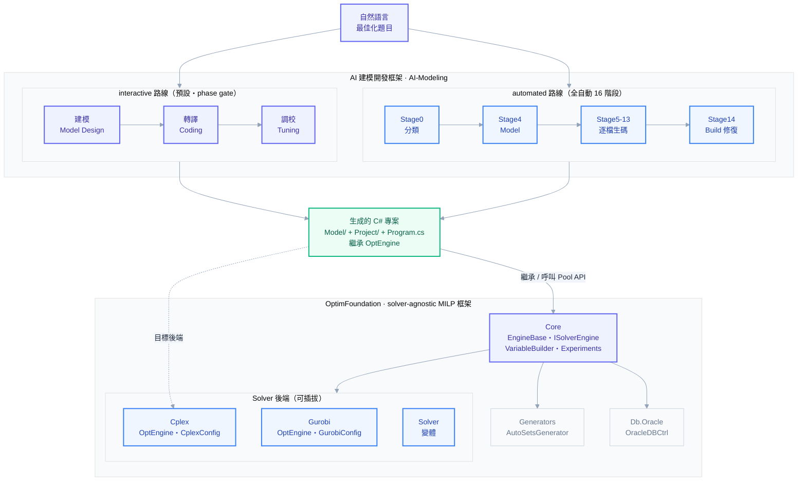

# 框架全景：AI 建模框架 × OptimFoundation

自然語言題目 → AI 建模框架（兩條路線）→ 生成 C# 專案 → 消費底層 OptimFoundation MILP 框架求解。

## 圖例

| 顏色 | 含義 |
| --- | --- |
| 靛藍（primary） | 入口 / 主流程 / 核心模組 |
| 藍（accent） | automated 階段 · 可插拔 Solver 後端 |
| 綠（success） | 產出物：生成的 C# 專案 |
| 灰（muted） | 支援模組（source generator、Oracle 資料層） |

## 兩層各含什麼

**AI 建模開發框架（上層）** — 把自然語言題目變成可求解 C# 專案，兩條路線：
- **interactive**：三階段 phase gate（建模 → 轉譯 → 調校），模型經確認才寫 code
- **automated**：16 階段全自動（Stage0 分類 → Stage4 Model 數學模型 → Stage5-13 逐檔生碼 → Stage14 Build 修復迴圈）

**OptimFoundation（下層）** — solver-agnostic MILP 框架（C# / .NET 8）：
- **Core**：EngineBase、ISolverEngine、VariableBuilder、Experiments、Csv/Db/Logging 工具
- **Solver 後端**：Cplex、Gurobi、Solver 變體（同一套 API、可換後端）
- **Generators**：AutoSetsGenerator（source generator）
- **Db.Oracle**：OracleDBCtrl（Oracle 資料存取）

**銜接**：生成的 C# 專案繼承 `OptEngine`、用 Pool API（`AddLHS`/`AddRHS`）建模，目標後端為 CPLEX。
