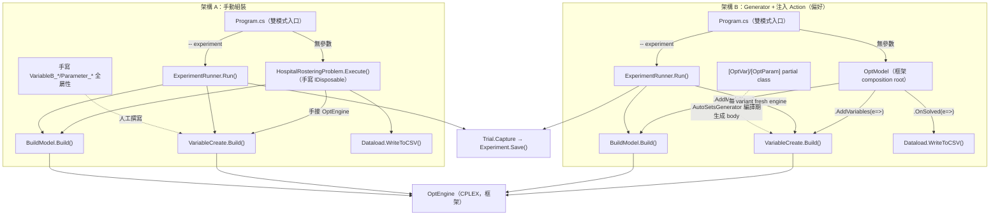

# CodeMap：雙架構醫院排班

[TOC]

- [Dependency Graph](#dependency-graph)
- [File Index](#file-index)
- [Symbol Index](#symbol-index)

## Dependency Graph

要點：兩架構**數學模型零差異**（同一份 `Model/HospitalRostering_Model.md`、同一組變數/限制式）。差異只在 ① composition root（手寫 `Problem.Execute()` vs Fluent `OptModel` 注入 Action）② 變數/參數 class 來源（手寫 vs `[OptVar]`/`[OptParam]` 生成）。tuning（`ExperimentRunner`）兩版都手接 `OptEngine`，形狀一致。

## File Index

| 路徑（相對各專案 root） | 角色 | A 手動 | B Generator |
|------|------|------|------|
| `*.csproj` | 專案參考 | dll HintPath，**不掛 generator** | dll + `OptimModeling.Generators` analyzer + `EmitCompilerGeneratedFiles` |
| `Program.cs` | 雙模式入口 | `new Problem().Execute()` | Fluent `OptModel` |
| `HospitalRosteringProblem.cs` | composition root | **有**（手寫 IDisposable） | **無**（OptModel 取代） |
| `ExperimentRunner.cs` | tuning 掃描 | 手接 OptEngine + 共用 build-step | 同左 |
| `Model/HospitalRostering_Model.md` | 數學模型 | 同一份 | 同一份 |
| `Set/Dataload.cs` | Sets/Params/WriteToCSV | 同 | 同 |
| `Parameter/Parameter_*.cs` | 5 個參數 | 手寫屬性 | `[OptParam]` partial |
| `Variable/VariableB_*/X_*.cs` | 9 個變數 | 手寫屬性 | `[OptVar]` partial |
| `Variable/VariableCreate.cs` | 建變數（兩模式共用） | 同 | 同 |
| `Objective/ObjectiveFunction.cs` | 目標式 | 同 | 同 |
| `Constraint/Constraint_*.cs` | 10 條限制式（C1–C11） | 同 | 同 |
| `Constraint/BuildModel.cs` | 目標+限制組裝（兩模式共用） | 同 | 同 |

## Symbol Index

| Symbol | 模組 | Export / 簽名 | 角色 |
|--------|------|---------------|------|
| `OptModel` | OptimFoundation.Cplex | `.UseConfig(Func<CplexConfig>).AddVariables(Action<OptEngine>).AddModel(...).OnSolved(...).Execute()` | B 的 composition root |
| `HospitalRosteringProblem` | `HospitalRostering_Manual` | `: IDisposable`，`Execute()`、`Dispose()` | A 的 composition root（手寫） |
| `OptEngine` | OptimFoundation.Cplex | `BuildBVs/CVs<T>`、`AddLHS/AddRHS`、`CreateEqual/LessEqual/GreatEqual`、`Solve`、`GetSetVarValues<T>` | 求解引擎窗口 |
| `AutoSetsGenerator` | OptimModeling.Generators | `[OptVar(VarType, sets…)]`、`[OptParam(sets…, HasValue=)]` → 生成 partial class body | B 的變數/參數生成器 |
| `VariableCreate` | `<Proj>.Variable` | `(Dataload, OptEngine)` → `.Build()` | 建變數（兩模式共用） |
| `BuildModel` | `<Proj>.Constraint` | `(Dataload, OptEngine)` → `.Build()` | 建目標+限制（兩模式共用） |
| `ExperimentRunner` | `<Proj>` | `static Run()`：variants 掃描 + `Trial.Capture` + `Experiment.Save` | tuning（兩版同形狀） |
| `Dataload` | `<Proj>.Set` | Sets/Parameters + `WriteToCSV(OptEngine)` | 資料載入 + 落地 |
| `Experiment` / `Trial` | OptimFoundation.Core | `new(name,desc)`、`.AddTrial`、`.Save()`；`Trial.Capture(engine,label,Func<bool>)` | tuning harness |

## 變數 / 限制式 ↔ 模型對照

| C# Variable | 數學符號 | Sets |
|------|------|------|
| `VariableB_ShiftAssign` | \(y_{e,d,g}\) | Date, Employee, Group |
| `VariableB_Off1Day` | \(s^{off1}_{ed}\) | Date, Employee |
| `VariableB_SixDayWork` | \(s^{six}_{ed}\) | Date, Employee |
| `VariableB_GroupMismatch` | \(s^{mis}_{ed}\) | Date, Employee |
| `VariableB_NightToDay` | \(s^{ntd}_{ed}\) | Date, Employee |
| `VariableB_DoubleOffFlag` | \(s^{dfl}_{ed}\) | Date, Employee |
| `VariableB_DoubleOffLT2` | \(s^{dlt}_{e}\) | Employee |
| `VariableX_BelowAVG` | \(z^{avg}_{e}\) | Employee |
| `VariableX_WeekendLT4` | \(z^{wkd}_{e}\) | Employee |

| C# Constraint | 模型條目 |
|------|------|
| `Constraint_OneGroup` | C1 每人每天恰一班 |
| `Constraint_FullfillDemand` | C2 每日各班別需求 |
| `Constraint_PreAssign` | C3 預排班固定 |
| `Constraint_SixDayWork` | C4 連六天指示 |
| `Constraint_CrossGroup` | C5 跨組別支援指示 |
| `Constraint_NightToDay` | C6 不良班別轉換 |
| `Constraint_OffOneDay` | C7 做一休一做 |
| `Constraint_DoubleOffLT2` | C8+C9 連休 2 天旗標 + 每月至少一次 |
| `Constraint_BelowAVG` | C10 休假不低於平均 |
| `Constraint_WeekendLT4` | C11 週末休假彈性 |
