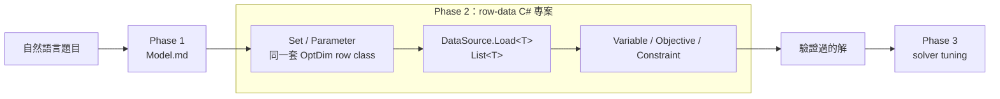

# 新版框架全景



OptimFoundation 的上層專案把模型資料、模型定義與 solver 執行分開：

- **Set**：描述存在的組合，例如可用弧 `(From, To)`；CSV 只有 Dim 欄。
- **Parameter**：描述組合對應的數值；CSV 是同一組 Dim 欄，再加最後一欄 `QTY`。
- **Data source**：用 `Load<T>()` 讀取兩者，回傳 `List<T>`；CSV、資料庫或記憶體來源的差異封裝在 `IDataSource`。
- **Variable / Objective / Constraint**：以 row list 與 parameter list 建立數學模型。變數由 `BuildVars<T>` 展開。
- **Program.cs**：唯一知道完整 `Dataload` 的組裝點；`Objective` 與 `Constraint` 只接收自己需要的資料。

## Set / Parameter 的關鍵差異

| 項目 | Set | Parameter |
| --- | --- | --- |
| 是否為 row class | 是 | 是 |
| Dim 宣告 | 一個以上 | 零個以上 |
| 值欄 | 無 | 固定為最後一欄 `QTY` |
| CSV | Dim 欄 | Dim 欄 + `QTY` |
| 載入與輸出 | `Load<T>()` / `WriteRows` | `Load<T>()` / `WriteRows` |

因此多維 Set 不需要另一套語法，也不是由其他 Set 組成的 brick。它就是多個 primitive `OptDim` 所構成的一列 tuple。

```csharp
[OptSet]
[OptDim<string>("From")]
[OptDim<string>("To")]
public sealed partial class Set_Arc { }

[OptParam]
[OptDim<string>("From")]
[OptDim<string>("To")]
public sealed partial class Parameter_ArcCost { }
```

設計原則是：資料來源只負責轉型與供應 row；CSV 輸出忠實輸出 row；資料詮釋與最佳化邏輯留在模型層。
